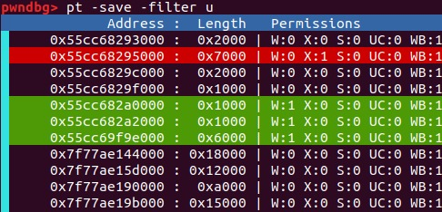
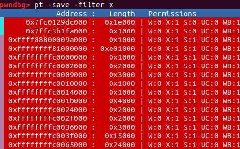
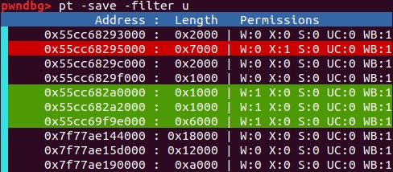
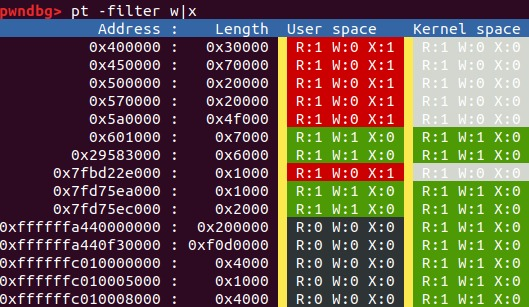
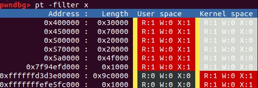
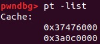

# gdb-pt-dump

`gdb-pt-dump` is a gdb script to examine the address space of a QEMU-based virtual machine.
Although this is also possible via the `monitor` and `pwndbg` interfaces, working with them is cumbersome, slow and sometimes they produce erroneous results.

## Features

* Dumping a page table from a specific guest physical address.
* Merging semantically-similar contiguous memory.
* Provide detailed architectural information: writeable, executable, U/S, cacheable, write-back, XN, PXN, etc
* Cache collected information for future filtering and printing.
* Filter page table information via page attributes (x, w, u, s, ...) and virtual addresses (before, after, between)
* Search memory very fast using `/proc/QEMU_PID/mem`. Search for string, u8, u4
  Search is applied after filter.
* Filter-out search results by address alignment. Useful for filtering-out SLAB allocations.
* Try to determine KASLR information by examining the address space.
* Find virtual memory aliases.

## How to use

The script is standalone.

For now, do `source PATH_TO_PT_DUMP/pt.py`.

For details, just do `help pt` in gdb.

## Examples

## Possible issues

Old QEMU versions seem to not provide access to privileged registers like cr3.
Thus, the page table address would need to be retrieved in some other way.

## Supported architectures

Supported architectures: `x86-64`, `aarch64`, `riscv64`.
Planned: `x86-32`.
